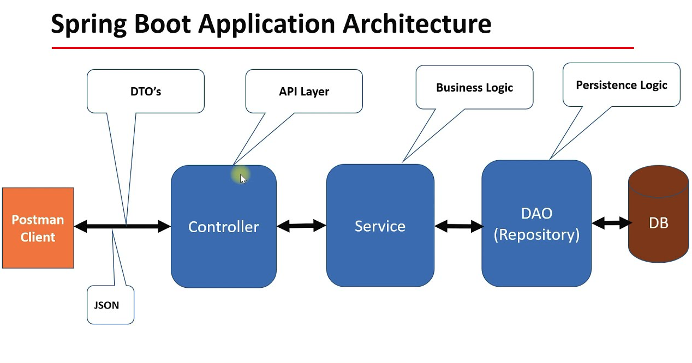

# Spring Boot

---

## Spring Boot
Spring Boot is an open-source Java-based framework used to create stand-alone, production-grade Spring-based applications quickly and efficiently. It is build on top of the [**Spring Framework**](https://github.com/ashok07-ai/basics-of-spring-framework) and provides pre-configured setups to simplify the development process by reducing boilerplate code and configuration.  
**Spring Boot** = **Spring Framework + Prebuilt Configuration + Embedded Servers**

---

## Spring VS Spring Boot
- **Spring**: Lots of steps involved in setting up, configuration, writing boilerplate code, deployment of the app.
- **Spring Boot**: Offers a set of pre-configured components or defaults, and eliminating the need for a lot of boilerplate code that was involved in setting up a Spring Application.

---

## Components of Spring Boot
- Spring Boot Starters
- Auto Configuration
- Spring Boot Actuator
- Embedded Server
- Spring Boot DevTools

---

## Advantages of Spring Boot
- Stand alone and Quick Start
- Starter Code
- Less Configuration
- Reduced cost and application development time
- Avoids boilerplate code and configurations
- Monitoring and Management
- Microservices Ready

---

## Architecture of Spring Boot
Spring Boot is built on the top of **Spring Framework**, following the layered architecture design. It simplifies and accelerates the development of enterprise-grade Java applications by integrating various components with an opinionated approach.

### 1. Layered Architecture in Spring Boot
Spring Boot applications are typically designed with the following layers.
- **Presentation Layer (Controller Layer)**: Presentation layer represents the data and the application features to the user. This is the layer where in all the controller classes exist.
  - **Purpose**: Handles user interaction (e.g, HTTP requests) and forwards them to the business layer.
  - **Key Components**: Controllers, defined using [@Controller or @RestController](https://docs.spring.io/spring-boot/tutorial/first-application/index.html#getting-started.first-application.code.mvc-annotations). Request Mappings **(@GetMapping, @PostMapping, etc.)**.
  - **Technologies**: Spring MVC, Thymeleaf, REST APIs.
  - **Responsibilities**: Managing HTTP requests and responses. Returning views (e.g, HTML) or serialized JSON response for REST APIs.
  
- **Business Layer (Service Layer)**: Service Layer is where business logic resides in the application. Tasks such as evaluations, decision making, processing of data is done at this layer.
  - **Purpose**: Contains the business logic of the application.
  - **Key Components**: Service classes annotated with **@Service**. Encapsulates business rules and interacts with the data access layer.
  - **Responsibilities**: Implements core logic independent of the presentation. Provides reusable methods for various controllers.  
- **Data Access Layer (Repository Layer)**: Data access layer is the layer where all the repository classes reside.
  - **Purpose**: Manages the persistence of application data.
  - **Key Components**: Repositories or DAOs (Data Access Objects), and annotated with @Repository. Uses Spring Data JPA or JDBC for database interactions.
  - **Responsibilities**: CRUD operations on the database. Converts business objects to database entities and vice versa.
  
- **Database Layer**:
  - **Purpose**: The physical database where application data is stored.
  - **Technologies**: Relational Databases (MySQL, PostgreSQL, Oracle), NoSQL Databases (MongoDB).
  - **Responsibilities**: Stores application data. Handles schema and Query Optimizations.

---

## Spring Initializer
The Spring Initializer is a web-based tool provided by the Spring team to quickly generate and bootstrap Spring Boot projects. It simplifies the process of creating a new Spring Boot application by providing a graphical interface to configure the project’s dependencies, settings, and structure.  
Click the link to redirect in Spring Initializer website: [Spring Initializer](https://start.spring.io/)

---

## Database Management System (DBMS)
It is a software application that enables users to efficiently create, access, manage, and manipulate databases. DBMS serves as an interface between the database and its users or application programs, ensuring that data is consistently organized and easily accessible.

### Key features of DBMS
- Data Storage and Retrieval
- Data Integrity
- Data Security
- Data Independence
- Backup and Recovery
- Transaction Management

### Types of DBMS
- [**Relational DBMS (RDBMS)**](https://www.oracle.com/database/what-is-a-relational-database/#:~:text=The%20software%20used%20to%20store,storage%2C%20access%2C%20and%20performance.)
  - Example: MySQL, PostgreSQL, Oracle, SQL Server.
 
- [**Hierarchical DBMS**](https://www.geeksforgeeks.org/hierarchical-model-in-dbms/)
  - Example: IBM Information Management System (IMS)
 
- [**Network DBMS**](https://www.geeksforgeeks.org/network-model-in-dbms/)
  - Example: Integrated Data Store (IDS)
 
- [**Object-Oriented DBMS (OODBMS)**](https://www.geeksforgeeks.org/definition-and-overview-of-odbms/)
  - Example: ObjectDB.
 
- [**NoSQL DBMS**](https://www.mongodb.com/resources/basics/databases/nosql-explained)
  - Example: MongoDB, Cassandra, CouchDB.

